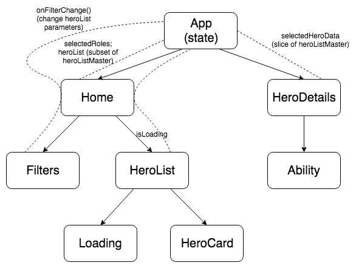

# Heroes Interface

A React-based interface for viewing information on characters from Blizzard's Heroes of the Storm. Includes role-based filtering of displayed heroes and hero-specific details pages.

View a live demo at [heroes-interface.netlify.com](https://heroes-interface.netlify.com).

## Structure

Data for all heroes is gathered from HotsAPI on app load. Visible heroes on the home page are a a subset of this data, dependent on the selection of filters.

Component structure and data flow is as follows:


## Setup

To run this project locally:

1. [Install Node.js and npm](https://www.npmjs.com/get-npm), if not already present in your local environment.
2. Clone this repository.
3. Within your preferred shell, navigate to the project folder and run the following:

  ```npm install```
(this may take a moment to complete)

  ```npm run start```

Once running, the app can be accessed at [http://localhost:3000/](http://localhost:3000/).

### Support and Contact Details
If you encounter any bugs or would like to make suggestions regarding this project, please feel free to open an issue within the repository.

#### Coming Soon, Hopefully
• Filter heroes by universe (not readily supported by available data set)

• Talent information on hero details page

#### Known Issues
• Refreshing a hero's details page will result in a loss of state, rendering necessary data inaccessible until navigating back to the home page.

• Certain data is currently missing from the data set, including images for recently-released heroes as well as all ability icon images.

• Ability display is inelegant for the select few heroes with more than one set of abilities bound to the Q, W, and E hotkeys.

### License

This project is distributed under the MIT License - see the [LICENSE](LICENSE) file for details.
